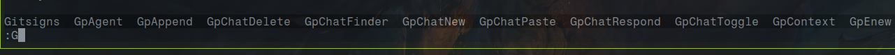
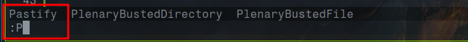

# AstroNvim Template

**NOTE:** This is for AstroNvim v4+

A template for getting started with [AstroNvim](https://github.com/AstroNvim/AstroNvim)

## 🛠️ Installation

#### Make a backup of your current nvim and shared folder

```shell
mv ~/.config/nvim ~/.config/nvim.bak
mv ~/.local/share/nvim ~/.local/share/nvim.bak
mv ~/.local/state/nvim ~/.local/state/nvim.bak
mv ~/.cache/nvim ~/.cache/nvim.bak
```

#### Create a new user repository from this template

Press the "Use this template" button above to create a new repository to store your user configuration.

You can also just clone this repository directly if you do not want to track your user configuration in GitHub.

#### Clone the repository

```shell
git clone https://github.com/meetorion/astronvim_config.git ~/.config/nvim
```

#### Start Neovim

```shell
nvim
```

## 添加插件
- 命令行自动补全插件
https://github.com/gelguy/wilder.nvim

配置模糊匹配：
```lua
wilder.set_option('pipeline', {
  wilder.branch(
    wilder.cmdline_pipeline({
      -- sets the language to use, 'vim' and 'python' are supported
      language = 'python',
      -- 0 turns off fuzzy matching
      -- 1 turns on fuzzy matching
      -- 2 partial fuzzy matching (match does not have to begin with the same first letter)
      fuzzy = 1,
    }),
    wilder.python_search_pipeline({
      -- can be set to wilder#python_fuzzy_delimiter_pattern() for stricter fuzzy matching
      pattern = wilder.python_fuzzy_pattern(),
      -- omit to get results in the order they appear in the buffer
      sorter = wilder.python_difflib_sorter(),
      -- can be set to 're2' for performance, requires pyre2 to be installed
      -- see :h wilder#python_search() for more details
      engine = 're',
    })
  ),
})
```

- 粘贴图片插件
https://github.com/TobinPalmer/pastify.nvim


- 终端显示图片插件
https://github.com/3rd/image.nvim
需要安装imagemagick
```bash
paru -S imagemagick
```

## Golang开发配置

## neovim配置obsidian

## vim esc插件
```lua
'h-hg/fcitx.nvim'
```
